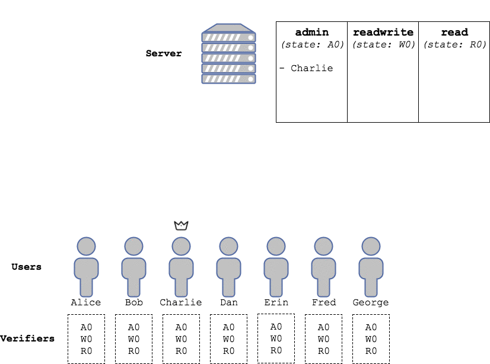

# collections

<!---[](https://travis-ci.org/dedis/student_17_collections)
[](https://codecov.io/gh/dedis/student_17_collections/branch/develop)-->

A `collection` is a Merkle-tree based data structure to securely and verifiably store *key / value* associations on untrusted nodes. The library in this package focuses on ease of use and flexibility, allowing to easily develop applications ranging from simple client-server storage to fully distributed and decentralized ledgers with minimal bootstrapping time.

## Table of contents

- [Overview](#overview)
   * [Basic use example](#basic-use-example)
      + [The scenario](#the-scenario)
      + [The `collection` approach](#the-collection-approach)
   * [Hands on](#hands-on)
      + [Getting started](#getting-started)
      + [Creating a `collection` and a `verifier`](#creating-a-collection-and-a-verifier)
      + [Manipulators](#manipulators)
      + [`Record`s and `Proof`s](#records-and-proofs)

## Overview

### Basic use example

Here we present a simple example problem, and discuss how it can be addressed by using a `collection`, without discussing implementation details, but rather focusing on the high-level features of a `collection` based storage. 

More advanced scenarios will be introduced in later sections of this document. If you prefer to get your hands dirty right away, you can jump to the [Hands on](#hands-on) section of this README.

#### The scenario

The users of an online community want to organize themselves into three groups with different permission levels: `admin`, `readwrite` and `readonly`. Users in the `admin` group can, e.g., read and write documents, and update the permission level of other users (`admin`s included); users with `readwrite` access can, e.g., update documents but not change privileges; and `readonly` users can, e.g., only read documents.

A server is available to the users to store and retrieve information. However, the server is managed by a third party that the users don't trust. Indeed, they will assume that, if it will have the opportunity to do so, the server will maliciously alter the table of permission levels in order, e.g., to gain control of the community.

#### The `collection` approach

As we will see in the next sections, organizing data in a `collection` allows its storage to be outsourced to an untrusted third party. In short:

 - Every `collection` object stores, at least, an *O(1)* size *state* (namely, the label of the root of a Merkle tree, see later).
 - The *state* of a `collection` uniquely determines **all** the *key / value* associations that the `collection` *can* store. However, a `collection` can actually store an arbitrary subset of them. In particular, we will call `verifier` a `collection` that stores no association (note how a `verifier` is therefore *O(1)* in size).
 - A `collection` storing an association can produce a `Proof` object for that association. A `Proof` proves that some *association* is among those allowed by some *state*. Provided with a `Proof` that starts with its *state*, a `collection` can verify it and, if it is valid, use it to add the corresponding associations to the ones it is storing.
- A `collection` can alter the associations it is storing by adding, removing and changing associations. This, however, changes the *state* of the `collection`.
- One or more `Proof`s can be wrapped in an `Update` object. Provided with an `Update` object, a `collection` can:
   * Verify all the proofs contained in it and use them, if necessary, to extend its storage with the associations it wasn't storing.
   * Verify that some update is applicable on the associations contained in the `Proof`. What constitutes a valid `Update` clearly depend on the context where `collection`s are used. Indeed, a ledger can be defined as a set of allowed `Update`s.
   * Apply the `Update`, thus producing a new *state* for the `collection`.
   * Drop all the associations it is not willing to store. Remember that *as long as it keeps track of the state, the changes applied to the associations will be permanent!*.

Our users can therefore make use of the untrusted server as follows:

 * The untrusted server will store one `collection` for each group. Each `collection` will associate no value to each key. Therefore each `collection` will, in practice, represent a set, just like a `map[string]struct{}` can be used to store a set of `string`s.
 * Each user will run a `verifier` for each group, storing only the fixed size *state*.
 * `Update`s to each `collection` will be broadcasted to all `verifier`s, that will check them and update their *state* accordingly.
 * Users will be able to query the server, and use their `verifier`s to verify that it provides honest answers.




### Hands on

If you are already familiar with the basic notions behind a `collection`, and just need to get started, this section is what you are looking for. If you need a better understanding of how a `collection` works, you might want to skip this section for now, and dive in [`collection` for dummies](#collection-for-dummies), where you will find all the information you need to bootstrap yourself in the world of `collection`s.

#### Getting started

To install this library, open a terminal `go get` it:

```bash
go get github.com/dedis/student_17_collections
```

Done? Great. Now you just need to import it:

```go
import collections "github.com/dedis/student_17_collections"
```

That's all. You are ready to go. Remember, from now on, we will use `collections` as the name of the package.

#### Creating a `collection` and a `verifier`

The simplest way to get a `collection` and a `verifier` is:

```go
my_collection := collections.EmptyCollection()
my_verifier := collections.EmptyVerifier()
```

This will give you an empty `collection` with no fields (i.e., just a set, as we have seen in [Basic use example](#basic-use-example)), and an empty `verifier`, also with no fields. By empty, here, we mean that the states of `my_collection` and `my_verifier` are the same, and that no record whatsoever can be proved from them.

If you wish to specify one or more value types that you want to be associated to each key, you can provide one or more `field`s to the constructors. You are free to define your own value types (see [Defining custom fields](#defining-custom-fields)) but we provide some that are ready to use.

For example, we could create an empty `collection` (and an empty `verifier`) that to each key associate a 64-bit amount of stake and some raw binary data by

```go
my_collection_with_fields := collections.EmptyCollection(collections.Stake64{}, collections.Data{})
my_verifier_with_fields := collections.EmptyVerifier(collections.Stake64{}, collections.Data{})
```

#### Manipulators

The set of records in a `collection` can be altered using four manipulators: `Add`, `Remove`, `Set` and `SetField`, to add an association, remove one, and set either all or one specific value associated to a key.

In general, you probably want to wrap a set of manipulations on a `collection` in an `Update` object (which also carries proofs: this allows it to be verified and applied also on `collection`s that are not currently storing the records that are being altered, like a `verifier`).

For now, however, let's add some records to our `my_collection_with_fields` and play around with them. Each record, as we said, is an association between a `key` and zero or more values. A `key` is always of type `[]byte` (therefore a `key` can be arbitrarily long!).

The manipulators syntax is pretty straightforward:

```go
my_collection_with_fields.Add([]byte("myfirstrecord"), uint64(42), []byte("myfirstdatavalue")) // Adds an association between key "myfirstrecord" and values 42 and "myfirstdatavalue".
my_collection_with_fields.Add([]byte("anotherrecord"), uint64(42), []byte{}) // Another record with empty data field.

my_collection_with_fields.Remove([]byte("myfirstdatavalue")) // I didn't like it anyway.

my_collection_with_fields.Set([]byte("anotherrecord"), uint64(33), []byte("betterthannothing")) // Note how you need to provide all fields to be set
my_collection_with_fields.SetField([]byte("anotherrecord"), 1, []byte("Make up your mind!")) // Sets only the second field, i.e., the Data one.
```

That's it. Now `my_collection_with_fields` contains one record with key `[]byte("anotherrecord")` and values `(uint64(33), []byte("Make up your mind!"))`.

All manipulators return an `error` if something goes wrong. For example:

```go
err := my_collection_with_fields.Add([]byte("anotherrecord"), uint64(55), []byte("lorem ipsum"))

if err != nil {
	fmt.Println(err)
}
```

Outputs `Key collision.`, since a record with key `[]byte("anotherrecord")` already exists in the `collection`. 

An `error` that all manipulators can return is `Applying update to unknown subtree. Proof needed.`. This happens when you try to manipulate a part of a `collection` that is not locally stored. Remember that, while the allowed set of records a `collection` can store is uniquely determined by its *state*, a `collection` can store an arbitrary subset of them. In particular, as we said, `verifier`s store no association locally, so if you try to

```go
err = my_verifier_with_fields.Add([]byte("myrecord"), uint64(65), []byte("Who cares, this will not work anyway."))

if err != nil {
	fmt.Println(err)
}
```

prints out `Applying update to unknown subtree. Proof needed.`. To manipulate records that are not locally stored by a `collection`, you first need to verify a `Proof` for those records. But all in due time, we will get to that later.

#### `Record`s and `Proof`s

Now that we know how to add, remove and update records, we can discuss what makes a `collection` such a useful instrument: `Proof`s.

##### `Get()`ting a `Record`

Let's first start with something easy. As we said, a `collection` is a *key / value* store. This means that in principle we could use a `collection` as we would use an (unnecessarily slow) Go `map`.

As in any *key / value* store, data can be retrieved from a `collection` by providing a `key`. Following from the `my_collection_with_fields` example, we can try to retrieve two `Record`s, one existing and one non-existing, by:

```Go
another, anothererr := my_collection_with_fields.Get([]byte("anotherrecord")).Record()
nonexisting, nonexistingerr := my_collection_with_fields.Get([]byte("nonexisting")).Record()
```

Now, **attention please!** Here one could expect `anothererr` to be `Nil` and `nonexistingerr` to be some `Error` that says something like: `Key not found`. However, *this is not what those errors are for!* When fetching a `Record`, not finding any association corresponding to a `key` here is not an error: indeed, the retrieval process was completed successfully and no association was found. So both of the above calls will return a `Record` object and no error. 

However, we *can* use `Match()` to find out if an association exists with keys `anotherrecord` and `nonexisting` respectively by

```Go
fmt.Println(another.Match()) // true
fmt.Println(nonexisting.Match()) // false
```

What call to `Get()` can return an `Error`, then? Simple: an `Error` is returned when a `collection` *does not know* if an association exists with the `key` provided because it is not storing it. For example a `verifier`, which does not permanently store any association, when queried as follows:

```Go
another, anothererr = my_verifier_with_fields.Get([]byte("anotherrecord")).Record()
fmt.Println(anothererr)
```

prints out: `Record lies in an unknown subtree.`

Along with `Match()`, a `Record` object offers two useful getters, namely:

```Go
fmt.Println(another.Key()) // Byte representation of "anotherrecord" (just in case you forgot what you asked for :P)

anothervalues, err := another.Values() // Don't worry, err will be non-Nil only if you ask for Values() and Match() is false.
fmt.Println(anothervalues[0].(uint64)) // 33
fmt.Println(anothervalues[1].([]byte)) // Byte representation of "Make up your mind!"
```

Please notice the type assertions! Since each field can be of a different type, `Values()` returns a slice of `interface{}` that need type assertion to be used.

Let us now stop for a second and underline what a `Record` is. A `Record` is just a structure that wraps the result of a query on a `collection`. It just says: "there is an association in this `collection` with key `anotherrecord` and values `33` and `Make up your mind!`", or: "there is no association in this `collection` with key `nonexisting`". You can **trust** that information only because, well, it was generated locally, by a computer that runs your software. However, what if, e.g., someone sent you a `Record` object over the Internet? You couldn't trust what it says more than any other message.

That is why we need `Proof`s.

##### `Get()`ting a `Proof`

So far, we have encountered `verifier`s quite many times, and you are probably wondering what purpose do they serve: they cannot be manipulated, you cannot `Get()``Record`s out of them... apparently, you can only create one and have it sit there for no reason! This is due to the fact that `verifier`s do not store any association, but only the *state* of the collection. However, we said that by just knowing the *state* of a collection, a `verifier` can learn about any association by verifying its `Proof`.

In this section we will not discuss *how* this can happen, but rather focus on how to use `Proof` objects in the context of this library. For more details on how `Proof`s are implemented, jump to <!-- TODO --> [?](?).

First of all, let's wipe the board and start again with an empty `collection` and an empty `verifier`. In this example, we will only have one `Stake64` field to make things less complicated (you can use what you have learned in the previous sections to generalize to a context with more than one field).

```Go
collection := EmptyCollection(Stake64{})
verifier := EmptyVerifier(Stake64{})
```

Now, as we said, `collection` will store all the associations allowed by its *state*, while `verifier` will store no association. However, the *state* of `collection` is identical to that of `verifier`. Let us now `Get()` our first `Proof`:

```Go
proof, err := collection.Get([]byte("mykey")).Proof()
```

Just like `Record`s, `Proof`s are valid even if no association is found with that key. Just like a `Record`, you can

```Go
fmt.Prinltn(proof.Match())
```

and get `false` printed out. Unlike a `Record`, however, a `Proof` is much more than an assertion which you can trust, in general, only if it was generated locally. A `Proof` actually contains a mathematical proof that says: *"association X exists under state Y"*, that can be verified without need of any other inforation. 

A key feature of `collection`s is that they can prove not only the existence of an association, but also its non-existence. In this case, `proof` indeed proves that no association with key `[]byte("mykey")` exists under the state that `collection` and `verifier` share.

Now, let's feed `proof` to `verifier`:

```Go
if verifier.Verify(proof) {
	fmt.Println("Yay!")
}
```

Yes, you guessed right: the above prints out `Yay!`. `proof` was successfully verified because:

 - It is consistent (each step is mathematically valid).
 - It starts with the same *state* as `verifier`, i.e., it proves something about the *state* that `verifier` shares with the `collection` that generated `proof`.

Calling `Verify()` on a `Proof` has not only the effect of returning `true` if the `Proof` is valid. It also serves the purpose to (sometimes temporarily) **extend** the knowledge of the `collection` that verifies it. Since it `Verify()`ed `proof`, `verifier` is storing the information needed to prove that `mykey` does not exist under its state and (see <!-- TODO --> [?](?) to find out why) to **add** a new association with key `mykey` and autonomously compute its new *state* accordingly.

Let's try this out. Indeed, if we try:

```Go
proof, err = verifier.Get([]byte("mykey")).Proof()
```

we get `err == nil`. You can also `Get()` a `Record` if you don't need a `Proof`:

```Go
record, recerr := verifier.Get([]byte("mykey")).Record()
```

Now let's try to use the same manipulator to add a record with key `mykey` to both `collection` and `verifier`:

```Go
err = collection.Add([]byte("mykey"), uint64(42)) // Success
err = verifier.Add([]byte("mykey"), uint64(42)) // Success!!
```

It worked! Thanks to `proof`, `verifier` had temporarily stored enough information to be able to manipulate `mykey`. `verifier` has autonomously recomputed a new *state*, from which the association `mykey -> 42` can be proved! You will notice, however, that if you now try:

```Go
proof, err = collection.Get([]byte("mykey")).Proof()
```

you will successfully get a `proof`, now with `proof.Match() == true`, that proves that `mykey` exists under the new state and is associated to `42`. Buf if you try the same with `verifier`:

```Go
proof, err = verifier.Get([]byte("mykey")).Proof()
```

you will get again the error `Record lies in an unknown subtree.`! What happened? Did `verifier` forget about `mykey`? **Yes**, because that is what `verifier`s are supposed to do: learn about a record only for the time strictly necessary, then forget about everything to save space. A **garbage collection** mechanism is implemented in all `collection`s so that when a record lies outside their `Scope` (see [`Scope`s](#scopes) for more information) it is removed:

 - After any manipulator is called (regardless of the key), if a transaction is not in progress (see [Transactions](#transactions) for more information).
 - At the `End()` of a transaction otherwise.

Let's now go back to `collection` and `verifier` and notice how their *states* are the same: they are still in sync. Now `collection` stores an association, `verifier` doesn't, but can learn about the association when needed without possibility of being fooled: it just needs a `Proof`.

##### Back to the permission levels example

**Congratulations!** Now you have enough knowledge on `collection`s to fully implement the example described in [Basic use example](#basic-use-example). Well, maybe you also need to know that we also made it simple to serialize and deserialize `Proof`s:

```Go
buffer := collection.Serialize(proof) // A []byte that contains a representation of proof. Feel free to send this over the Internet, or with a carrier pigeon!
proofagain, deserializeerr := collection.Deserialize(buffer) // It works, and you get proof again in proofagain
```

On the server side we will generate three `collection`s

```Go
admin := EmptyCollection()
readwrite := EmptyCollection()
read := EmptyCollection()
```

and each verifier will generate three `verifier`s

```Go
admin := EmptyVerfier()
readwrite := EmptyVerifier()
read := EmptyVerifier()
```

(both with no fields, as they represent a set). As key, they will use their public keys. This will also allow them to verify signatures. Now, say that an administrator sends its public key `padm` and a signed `(message, signature)` to add the public key `pwrite` to the `readwrite` `collection`.

On the server side:

```Go
adm, _ := admin.Get(padm).Record() // It will not fail, the collection is storing all the associations.
if adm.Match() {
	// Key padm actually belongs to an administrator!
	// (Verify that signature is valid for message)
	
	proofwrite, _ := readwrite.Get(pwrite).Proof()
	if proofwrite.Match() {
		// Send an error back: pwrite already exists in the readwrite collection, it cannot be added twice!
	} else {
		proofadm, _ := admin.Get(padm).Proof()
		// Broadcast to all verifiers: padm, proofadm, message, signature, pwrite, proofwrite
	}
}
```

And on the client side:

```Go
if !equal(padm, proofadm.Key()) || !(admin.Verify(proofadm)) || !equal(pwrite, proofwrite.Key()) || !(readwrite.Verify(proofwrite)) {
	// We have a cheater here! Return error.
}

if !(proofadm.Match()) {
	// There is no admin with key padm. Return error.
}

if proofwrite.Match() {
	// pwrite is already in the readwrite collection. Return error.
}

// (Verify that signature is valid for message)

readwrite.Add(pwrite)
```

And it's done! Every verifier still stores O(1) data but, provided with a `Proof`, they will always be able to verify that `pwrite` belongs to a user with `readwrite` privileges.