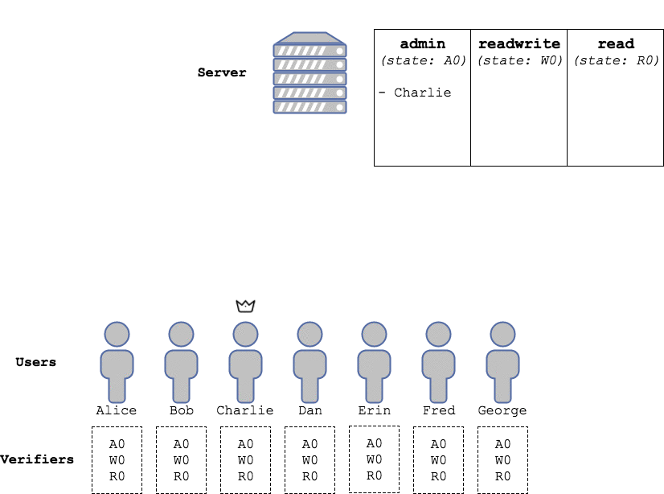

# collection

## Overview

Package `collection` is a Golang implementation of a Merkle-tree based (optionally weighted) collection.

A `collection` is an authenticated data structure that allows one or more `verifier`s to outsource the storage of a set of identifiers to one (or more) untrusted servers.

### Example use scenario

A distributed service wants to organize its users into three groups with different permission levels: `admin`, `readwrite` and `readonly`. Users in the `admin` group can, e.g., read and write documents, and update the permission level of other users (`admin`s included); users with `readwrite` access can, e.g., update documents but not change privileges; and `readonly` users can, e.g., only read documents.

In order to do this, the three sets of user identifiers (e.g., their public keys) are stored on an untrusted server, that users can query and push updates to. Each users should, however, have the possibility to check if the server is honestly storing the sets, without having to store a complete copy of them.

This can be achieved using `collection`s: 

 * The untrusted server will store one `collection` for each group. 
 * Each user will run a `verifier` with a fixed size state.
 * Updates to the `collection` will be broadcasted to each `verifier`, that will check them and update its state accordingly.
 * Users will be able to query the server, and use their `verifier`s to verify that it provides honest answers.

 

### Usage paradigm

A `collection` is an authenticated data structure that stores a set of identifiers in a way that allows an independent `verifier` to keep track of its content without having, e.g., to store a whole copy of the `collection`. Indeed, a `verifier` has O(1) persistent storage complexity and O(log(N)) computational complexity (N being the number of entries in the `collection`) when verifying queries and updates.

This is achieved through a cryptographic summary of the contents of the `collection` (namely, a Merkle tree root, *see later*), of which the `verifier` holds a copy. We will refer to this summary as **state** of the `collection`. The state has two important properties:

 * It changes as the contents of the `collection` change: the new state can be computed in O(log(N)) time from the old state and the required update.
 * It can be used to prove whether or not some identifier lies in the `collection` (and, in case of a weighted `collection`, what its value is).

As we said, a `verifier` needs to hold a copy of the state of the `collection` it is keeping track of. By knowing the state of the collection, it can:

 * **Query** the `collection` for an identifier (and, in case of a weighted `collection`, its value). Along with the `response` (namely, a boolean value that is `true` if the identifier lies in the `collection` and `false` otherwise and, in case of a weighted collection, the value of the identifier), the `collection` will provide a `proof` based on the current state of the `collection`, that the `verifier` is assumed to know. The `verifier` can now autonomously check the `proof` and verify that the `response` is correct (i.e., that it matches the state of the `collection`).
 * **Update** the `collection` (namely, by adding, removing or, in case of a weighted collection, updating the value of an identifier). Along with the `response` (namely, a boolean value that is `true` if the operation was successful, and `false` otherwise), the `collection` will provide a `proof` based on the state of the `collection` **before** the update, which the `verifier` is assumed to know. The `verifier` can now autonomously check the `proof`, verify that the `response` is correct, and **compute the new state of the `collection`**. By verifying all the updates to a `collection`, a `verifier` can therefore *keep its state in sync with that of the collection*.

##### Remark

The state of a `collection` with a given (possibly small or empty) set of elements can be uniquely and autonomously computed by any `verifier`. Following from the use case previously described (see the animation above), a set of `verifiers` that agree to have Charlie as first `admin` can define by recursion a set of **legal states** for the three `collection`s:

 * For the `admin` collection, a legal state is:
   * The state of a `collection` that contains only the identifier of Charlie.
   * Any state that can be obtained applying to a previous legal state a legal operation (in this case, an operation that is signed by someone that is proved to be in the `collection`).
 * For the other two collections, a legal state is:
   * The state of an `empty`  collection.
   * Any state that can be obtained applying to a previous legal state a legal operation (in this case, an operation that is signed by someone that is proved to be in the `admin` `collection`).
